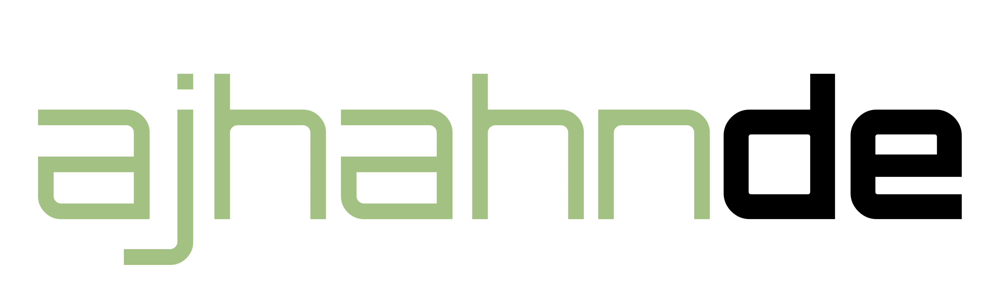

<picture>
  <source media="(prefers-color-scheme: dark)" srcset="assets/ajhahnde_logo_dark.png">
  
</picture>

  
  
  
  
  

  
  
  
  
  

  
  
  
  
  
  

---

* **[FlashOS](https://github.com/ajhahnde/FlashOS)** — AArch64 bare-metal kernel for the Raspberry Pi 4 Model B.
* **[Flash](https://github.com/ajhahnde/Flash)** — a systems language and Zig transpiler.
* **[the-way-out](https://github.com/ajhahnde/the-way-out)** — Top-down pixel-art escape-room shooter.
